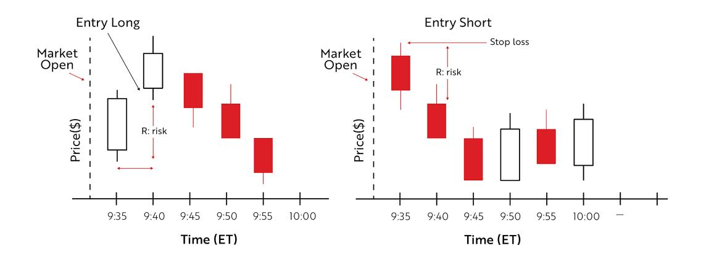
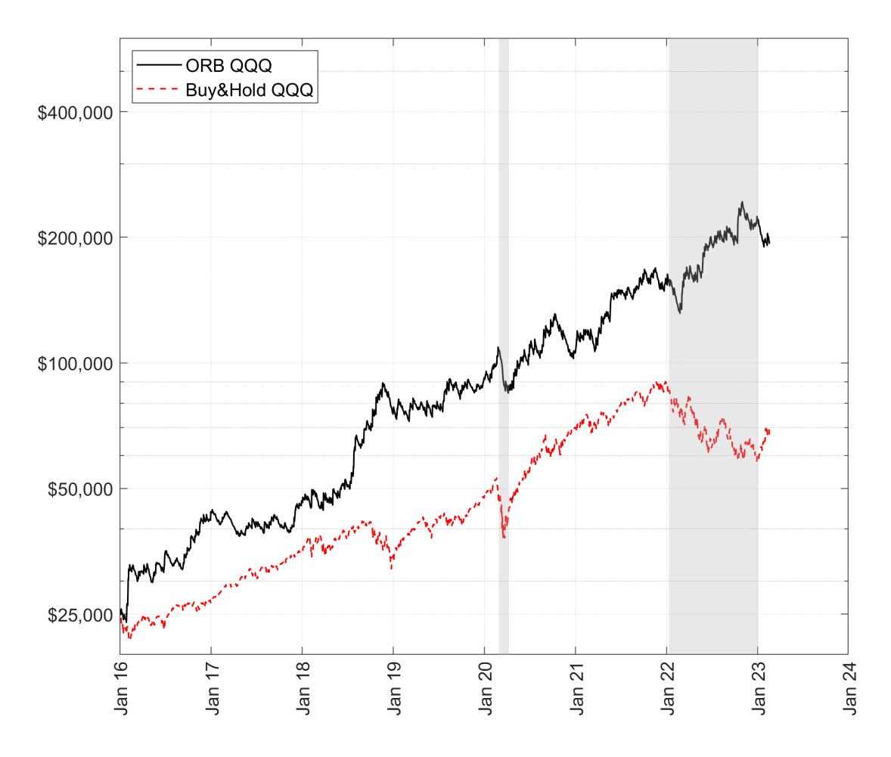
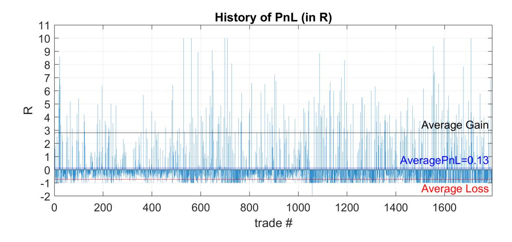
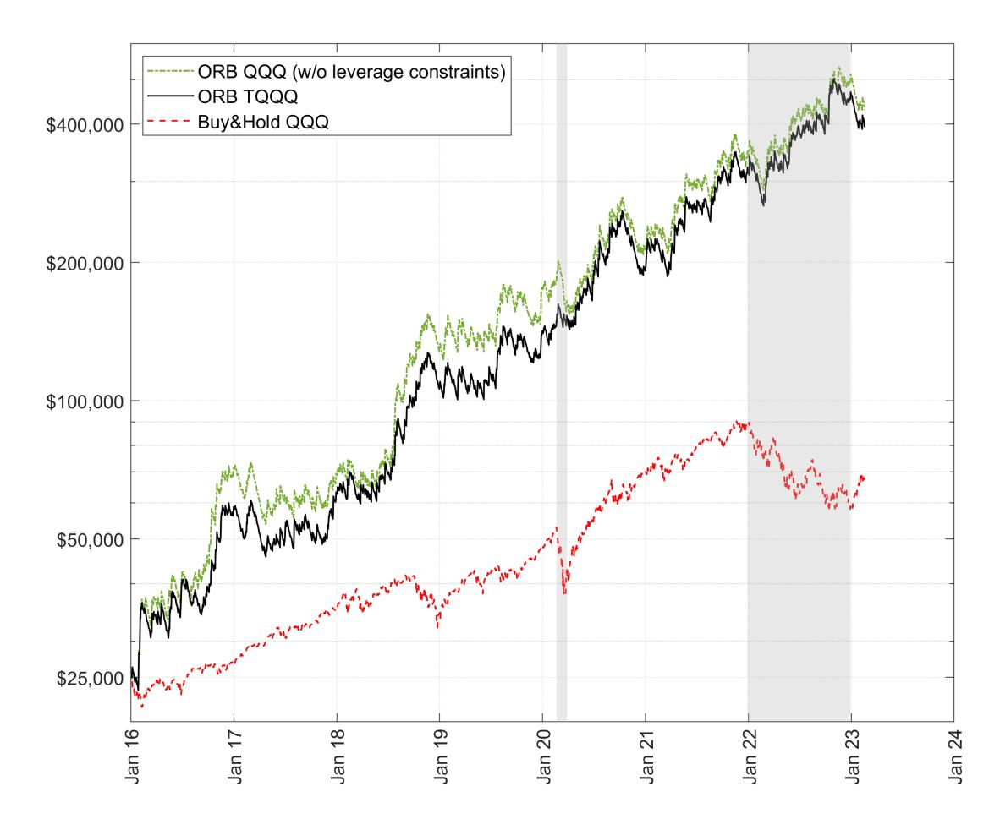
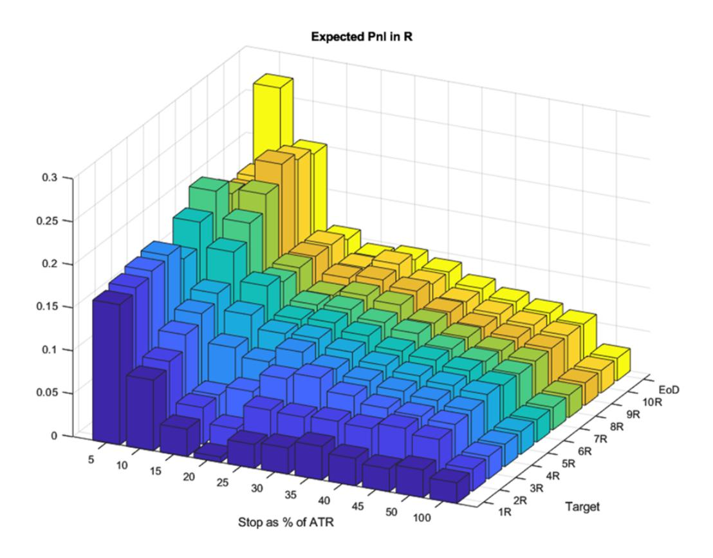
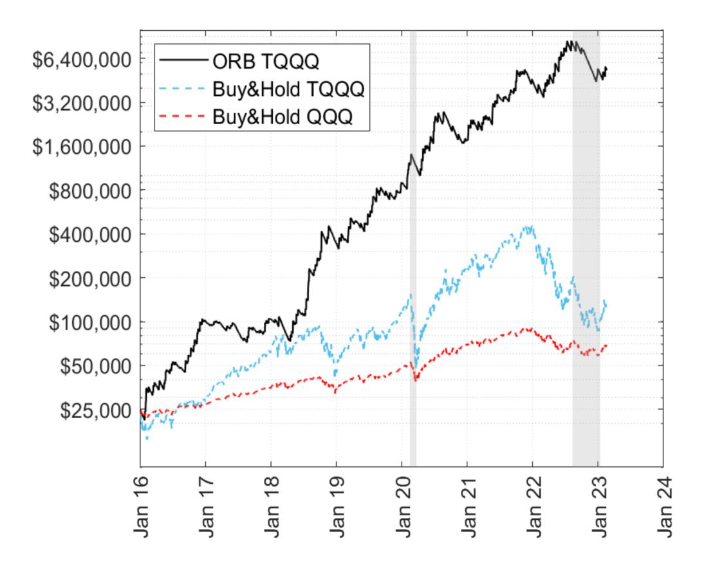

# Can Day Trading Really Be Profitable?

Evidence of Sustainable Long-term Profits from Opening Range Breakout (ORB) Day Trading Strategy vs. Benchmark in the US Stock Market

> Carlo Zarattini1 , Andrew Aziz2,3

1Concretum Research, Viale Carlo Cattaneo 1, 6900 Lugano, Switzerland 2Peak Capital Trading, 744 West Hastings Street, Vancouver, BC, Canada V6C 1A5 3Bear Bull Traders, 744 West Hastings Street, Vancouver, BC, Canada V6C 1A5

Q 1[carlo@concretumgroup.com,](mailto:carlo@concretumgroup.com) 2[andrew@peakcapitaltrading.com](mailto:andrew@peakcapitaltrading.com) X 1[@ConcretumR,](https://twitter.com/ConcretumR) 2[@BearBullTraders](https://twitter.com/BearBullTraders)

> First Version: April 24, 2023 This Version: April 21, 2025

#### Abstract

The validity of day trading as a long-term consistent and uncorrelated source of income for traders and investors is a matter of debate. In this paper, we investigate the profitability of the well-known Opening Range Breakout (ORB) strategy during the period of 2016 to 2023. This period encompasses two bear markets and a few events with abnormal volatility. Our results suggest that with the proper use of leverage or leveraged products (such as 3x leveraged ETFs), day trading can empirically produce significant returns when compared to a standard buy and hold strategy on benchmark indexes in the US public equity markets (Nasdaq or NYSE). Without any loss of generality, we studied the results of an ORB strategy implemented in QQQ. By comparing the results of the active day trading approach with a passive exposure in QQQ, we prove that it is possible for the ORB portfolio to significantly outperform the passive investment. In fact, the day trading portfolio produced an annualized alpha of 33% (net of commissions). Nevertheless, due to leverage constraints enforced by brokers, an active trader would have capped the full upside potential given by the ORB strategy. To overcome this issue, we introduced the use of TQQQ, a leveraged ETF of QQQ, which allows day traders to fully exploit the benefit of the active strategy while adhering to leverage constraints. The resulting portfolio would have earned an outstanding return of 1,484% during the same period of 2016 to 2023, while an investment in the QQQ ETF would have earned only 169%.

Keywords: Day Trading, ORB, Opening Range Breakout, Day Trading Systems, QQQ, TQQQ

### 1 Introduction

Day trading has become an increasingly popular approach to trading in recent years, particularly among retail investors. With the advent of new trading technologies and increased access to financial markets, more and more individuals are turning to day trading as a way to potentially generate significant returns. In fact, the rise of retail day traders has been so pronounced that it has been described as a "boom" in the industry. However, it was not until the COVID-19 pandemic struck in 2020 that retail day trading experienced a truly explosive growth [\(Baek and Jackman, 2021;](#page-17-0) [Caferra and Vidal-Tom´as,](#page-17-1) [2021\)](#page-17-1). With lockdowns and work from home policies in place, people found themselves with more time on their hands and many turned to day trading as a way to supplement their income or simply to pass the time. The impact of this surge in retail day trading was felt throughout the financial markets, with notable examples of retail traders making major gains in the stock market, the cryptocurrency market, and other major financial markets [\(Caferra and Vidal-Tom´as, 2021\)](#page-17-1). For instance, in August 2020, shares of Tesla soared over 70% in just two weeks, driven in part by retail traders piling into the stock. Similarly, in January 2021, a group of retail traders on Reddit managed to squeeze short sellers out of their positions in GameStop, causing the stock to skyrocket by over 1,600% [\(Anand and Pathak, 2022\)](#page-17-2).

Despite the growing popularity of day trading and the potential profitability of certain strategies, there are still many who doubt its validity as a long-term consistent approach to trading. This skepticism stems from a number of concerns, including the perceived difficulty of consistently generating profits through short-term trades, the potential for high transaction costs and taxes, and the risks associated with leveraging and margin trading [\(Yang et al., 2020\)](#page-17-3).

For example, Chague et al., in a study published in 2020, showed that it was virtually impossible for individuals to day trade the Brazilian equity futures market (ranked third in the world in terms of volume) between 2013 and 2015. They reported that 97% of all traders who traded more than 300 days in that period lost money [\(Chague et al.,](#page-17-4) [2020\)](#page-17-4). As another example, Barber et al. investigated the performance of day traders in

Taiwan trading on the Taiwan Stock Exchange between 1992 and 2006. They concluded that less than 1% of those day traders were able to predictably and reliably earn positive abnormal returns net of fees [\(Barber et al., 2019\)](#page-17-5). Additionally, some critics argue that day trading is essentially a form of gambling and that its success is largely based on luck rather than skill. They contend that day traders are simply trying to beat the market in the short term, rather than focusing on building long-term wealth through sound investment principles [\(Dorn et al., 2014;](#page-17-6) [H˚akansson et al., 2021\)](#page-17-7).

On the other hand, supporters of day trading argue that, when done correctly, it can be a valid and profitable approach to trading. They note that successful day traders employ rigorous risk management strategies, rely on proven trading methodologies, and stay disciplined and focused in the face of market volatility [\(Aziz, 2015;](#page-17-8) [Jordan and Diltz, 2019;](#page-17-9) [Aaziznia and Aziz, 2020;](#page-17-10) [Aziz, 2018;](#page-17-11) [Turner, 2007;](#page-17-12) [Conegundes and Pereira, 2020\)](#page-17-13).

Ultimately, the validity of day trading as a long-term consistent approach to trading is a matter of debate. While there are certainly risks involved and success is never guaranteed, many traders continue to find success through careful planning, disciplined execution, and a commitment to ongoing learning and improvement.

One popular strategy employed by day traders is the n-minute ORB strategy [\(Aziz, 2015\)](#page-17-8). As shown in Figure [1,](#page-3-0) this approach usually involves identifying the high and low points of a stock during the first n-minutes of trading, and then buying or selling when the stock breaks out of this range. A more simplistic version of this strategy can be obtained by buying or selling at the open of the second candle in the same direction of the first n-minute candle. This strategy is often used because it can generate quick profits, with traders looking to capitalize on the volatility that can occur at the beginning of the trading day. Aziz et al. have released several publications on using the ORB strategy in the US stock market [\(Aziz, 2015;](#page-17-8) [Aaziznia and Aziz, 2020;](#page-17-10) [Aziz, 2018\)](#page-17-11).

The objective of this paper is to examine the performance of the 5-minute ORB and to determine if it can beat a passive exposure on a well-known market index. Moreover, this paper clearly identifies the benefits for day traders obtained by the introduction of

Figure 1: Conceptual illustrations of where a trader would enter into a trade and set the stop loss when using the ORB strategy for going long (as shown on the left-hand side) and for going short (as shown on the right-hand side).

leveraged ETFs.

Our analysis was conducted during the period of January 1, 2016 to February 17, 2023. By increasing the sample period, the significance of our results would have been higher; nevertheless, due to changes in market dynamics and liquidity, we preferred to focus our empirical investigation on the most recent years.

Overall, this paper aims to contribute to the growing body of research on day trading strategies as well as provide valuable insights for both retail and institutional traders seeking to improve their performance in the market.

### 2 Strategy Definition

As previously referenced, a 5-minute ORB strategy is a strategy that allows the trader to bet on a breakout from the opening range during the first 5 minutes of the trading session. We applied the ORB strategy on the QQQ ETF[1](#page-0-0) , which is the most liquid instrument available that replicates the Nasdaq Index. This strategy can take both a long and a short exposure. Our model assumed that if there was to be an ORB, it would occur in the same direction of the first 5-minute move. In other words, if during the

1The Invesco QQQ ETF holds a group of cutting-edge Nasdaq-100 companies known as the "tech sector". Its portfolio includes a deep bench of innovators such as Apple, Alphabet (aka Google), Microsoft, and more. QQQ has been a very popular trading and investing instrument since the dot-com bubble.

first 5 minutes the market moved up, we took a bullish position starting from the second candle's opening price. Conversely, if the first 5-minute candle was negative, we took a bearish position at the open of the second 5-minute candle. No positions were opened when the first 5-minute candle was a doji (open = close). The stop loss was placed at the low of the day (which was the low of the first 5-minute candle) for a long trade, and at the high of the day (which was the high of the first 5-minute candle) for a short trade, as shown conceptually in Figure 1. The distance between the entry price and the stop is labeled as Risk(\$R).

We set the profit target at 10x the \$R. Should the target not have been reached by the end of the day (EoD), we liquidated the position at market closure. We assumed a starting capital of \$25,000, a maximum leverage of 4x, and a commission of \$0.0005/share traded. The trading size was calibrated such that if a stop was hit, we lost 1% of our capital. We used a 1% risk budget per trade as the historical average daily move on QQQ is 1%.

The summary of our model input variables is shown in Table [2.](#page-12-0) It is important to note that we deliberately kept the model very simple and did not try to "optimize" the parameters for better performance. The goal of this paper is to empirically compare the performance of a simple ORB strategy with a simple buy and hold market benchmark, and not to introduce a highly optimized, high-performance trading algorithm.

The appropriate share size was calculated by factoring in the size of the trading account, the amount of \$R, the percentage of the capital we wanted to risk per trade (1%), and the maximum leverage allowed by the broker (explained in more detail by [Elder](#page-17-14) [\(2014\)](#page-17-14) and [Aziz](#page-17-8) [\(2015,](#page-17-8) [2018\)](#page-17-11)). Accordingly, the formula utilized was:

$$
\text{Shares} = \text{int}\left[\min\left(\frac{A \times 0.01}{\$R}, \frac{4 \times A}{P}\right)\right],
$$

where Shares represents the number of shares to be bought or sold, P is the opening price of the second 5-minute candle, A denotes the size of the trading account, and \$R is the risk being assumed, calculated as \$R = P - StopPrice. The function int is used to ensure that the share count is a whole number, as trading fractions of a share is not possible.

|                        | Conditions                                                                                   | Notes                                                                  |
|------------------------|----------------------------------------------------------------------------------------------|------------------------------------------------------------------------|
| Underlying asset       | QQQ or TQQQ                                                                                  |                                                                        |
| Entry                  | Open of the second 5-minute candle.                                                       | We assumed no slippage in fills.                                       |
| Stop loss              | Low of the first candle for a long trade, high of the first can dle for a short trade. | The amount of the stop loss is known as R.                          |
| Profit target          | 10R or EoD                                                                                   | Whichever happens first.                                               |
| Partial profit target  | No                                                                                           |                                                                        |
| Maximum risk per trade | 1% of account size                                                                           |                                                                        |
| Maximum Leverage       | 4x                                                                                           | In accordance with the major ity of US FINRA-regulated bro kers. |
| Starting capital       | \$25,000 USD                                                                                 |                                                                        |
| Commission             | \$0.0005 per share                                                                           |                                                                        |
| Starting date          | 1 January 2016                                                                               |                                                                        |
| Ending date            | 17 February 2023                                                                             | Date of finalizing this paper.                                         |

Table 1: Strategy Description.

For comparison purposes, we created a benchmark that tracked the value of a portfolio that held a passive long exposure on QQQ with a starting capital of \$25,000. We did not include any commission for this benchmark portfolio.

The strategy was backtested using MATLAB R2022 and aggregated data were provided by Interactive Brokers.

### 3 Results and Discussion

Figure [2](#page-6-0) compares the equity curve performance of the 5-minute ORB strategy with the equity curve performance of an equivalent passive investment in the benchmark (i.e., QQQ). The economic outperformance is significant: a \$25,000 day trading account on January 1, 2016 would be worth \$192,806 (net of commissions) as of February 17, 2023. That is an outstanding total return of 675%. On the other hand, the benchmark would be worth \$67,307, which corresponds to a total return of 169%. To gauge the outperformance

Figure 2: A comparison between the equity curve performance of the ORB portfolio that day traded the QQQ ETF (both long and short) and the equity curve performance of the portfolio that passively utilized a simple buy and hold strategy in QQQ. Gray highlighting has been used to show when there were bear markets. All conditions were set as Table [2.](#page-12-0)

of the active strategy in excess of market risk (or benchmark risk), we ran the following regression[2](#page-0-0) on daily returns:

$$
Ret_{\text{ORB QQQ}} = \alpha + \beta \times Ret_{\text{QQQ}}.
$$

The annualized alpha was 33% (net of commissions) and is highly significant (p.value = 0.0025). The beta coefficient was not statistically different from zero, which implies that our active approach was not correlated with the benchmark.

2The α can be interpreted as the return of the strategy in excess of the market risk. The β component describes the correlation and leverage of the strategy returns with respect to passive QQQ returns.

Figure 3: A bar chart that represents the daily PnL (expressed in unit of Risk) of the ORB portfolio that day traded the QQQ ETF (both long and short). All conditions were set as Table [2.](#page-12-0)

The unsignificant level of beta suggests that over the backtested period, the active strategy switched equally from long to short, reducing the level of correlation with respect to a passive long only exposure on QQQ. In fact, out of 1,795 trades, 51% were long trades while 49% were short. The annualized Sharpe Ratio was 1.12 while the annualized rate of return was 31%.

As exhibited in Figure [3,](#page-7-0) we further analyzed the results of the strategy by plotting the time-series of the daily PnL (normalized by the \$R). As expected, due to the stop loss in place, the maximum daily loss was capped at -1R (a bit larger due to commissions). On the other hand, profits were capped at 10R. Profits were often below 10R, which means that the position was liquidated at market closure and the 10R profit was not reached. The Win Rate of the strategy was 24%, which made the average PnL per trade equal to 0.13R. A low accuracy was compensated by the asymmetry between gains and losses.

A further analysis of the historical PnL of the strategy suggested that many trades were not traded in full-size and the overall PnL therefore ended up being just a fraction of the R [3](#page-0-0) . The reason for this "anomaly" is found in the leverage limit imposed by the broker. As referenced in the strategy description, most US brokers do not allow intraday traders to take positions more than 4x greater than the net liquidation value of their portfolio.

3This can be easily captured by observing the losses that were usually a fraction of 1R, see Figure [3.](#page-7-0)

Figure 4: A comparison between the equity curve performance of the ORB portfolio that day traded the QQQ ETF (both long and short) without any leverage constraints, the equity curve performance of the ORB portfolio that day traded the QQQ ETF (both long and short) with leverage constraints, and the equity curve performance of the portfolio that passively utilized a simple buy and hold strategy in QQQ. Gray highlighting has been used to show when there were bear markets. Other conditions were set as Table [2.](#page-12-0)

This rule implies that in most trades, we were not able to put at risk 1performance of our ORB QQQ strategy with the equity curve performance of an ORB QQQ strategy without any leverage constraints. The results are exhibited in Figure 4% of the portfolio value (as per the strategy description). An attentive reader will wonder at this point whether the result obtained is suboptimal. To answer this question, we compared the equity curve performance of our ORB QQQ strategy with the equity curve performance of an ORB QQQ strategy without any leverage constraints. The results are exhibited in Figure [4.](#page-8-0)

The gap between the equity curve performance of our ORB QQQ strategy and the equity curve performance of the unconstrained leverage version of it is quite significant. The unconstrained version would have grown in the sample period by 1,630%, which is approximately 2x the growth of our ORB QQQ strategy. Leverage constraints do not allow an ORB trader to properly size each trade. Over the sample period, we estimate that 60% of the trades were conducted with an exposure 40% below the optimal exposure given by the unconstrained leverage version of the ORB strategy. In conclusion, the first implementation of the ORB strategy in QQQ, even if attractive from a return-to-risk perspective, does not fully exploit its edge over time.

To address this issue, we introduced the use of ProShares UltraPro QQQ (TQQQ[4](#page-0-0) ), a leveraged and liquid ETF that gives traders a 3x exposure to the daily fluctuation of QQQ. We surmised that the introduction of TQQQ would allow traders to circumvent the issue related to leverage constraints. In fact, a \$100 exposure in TQQQ should be approximately equal, on a daily basis, to a \$300 exposure on QQQ. Assuming a maximum leverage of 4x, it means that a \$25,000 account may be exposed to the same \$ daily moves obtained by a \$300,000 account fully invested in QQQ.

We ran the 5-minute ORB strategy on TQQQ and plotted the results in Figure [5.](#page-10-0) The portfolio tracked very closely the value arising from the implementation of the unconstrained version of the ORB strategy on QQQ. The use of TQQQ improved significantly the results of the ORB strategy and an astonishing total return of 1,484% was achieved during the 7-year period. The outperformance versus the passive benchmark is evident and confirmed by the results of the following regression:

4TQQQ is one of the largest ETFs with assets under management of \$13.13 billion (as of 21 March 2023). Due in part to QQQ's popularity, issuers of leveraged ETFs have tapped traders' thirst for more exotic ways to play the Nasdaq-100. TQQQ's objective is simple: to deliver triple the daily returns of the Nasdaq-100. Therefore, if that index rises by 1% on a particular day, TQQQ should jump by 3%. As is the case with any leveraged ETF, TQQQ is an instrument best used over intraday time frames, not as a buy and hold investment. Investors and traders who do not consider themselves "active" and "risk-tolerant" should eschew leveraged ETFs. In a paper published in 2021, Lewis investigated the longterm investing in 3x leveraged ETFs and concluded that as a result of daily rebalancing and so-called "beta slippage" or "the constant leverage trap", it is highly likely that over the long term, the result of leveraged ETFs will significantly deviate from the targeted leverage and, in so doing, generate wipeout losses. In fact, his data show that many 3x leveraged ETFs have performed poorly over the long term in the period of their existence.

Figure 5: A comparison between the equity curve performance of the ORB portfolio that day traded the QQQ ETF (both long and short) without any leverage constraints, the equity curve performance of the ORB portfolio that day traded the TQQQ ETF (both long and short), and the equity curve performance of the portfolio that passively utilized a simple buy and hold strategy in QQQ and TQQQ. Gray highlighting has been used to show when there were bear markets. All conditions were set as Table [2.](#page-12-0)

$$
Ret_{\text{ORB TQQQ}} = \alpha + \beta \times Ret_{\text{QQQ}}.
$$

The annualized alpha was 48% (net of commissions) (p.value = 0.0013) while the beta coefficient remained not statistically different from zero. The Sharpe Ratio was 1.19 and the annualized rate of return was 46%. During the same period, the passive benchmark (QQQ) would have earned an annualized return of 15% (169% total return).

As exhibited in Figure [6,](#page-11-0) by plotting the time-series of the daily PnL (in unit of Risk), we noticed that the average gain increased significantly (versus the ORB strategy in QQQ)

Figure 6: A bar chart that represents the daily PnL (expressed in unit of Risk) of the ORB portfolio that day traded the TQQQ ETF (both long and short).

and the resulting average PnL per trade was 0.18R (versus 0.13R for the ORB strategy in QQQ). There were only 10% of days when the exposure was capped by the leverage constraints, and in those few cases, the reduction of the exposure was approximately 30%.

The market regime from 2016 to 2023 was challenging. Although we did experience a nice bull market in the US stock market, some major events caused short-term significant corrections with spikes in volatility. For example, in 2018, we experienced a short volatility shock coined "Volmageddon", which resulted in the collapse of many large short volatility players [\(Augustin et al., 2021\)](#page-17-15). Moreover, in March 2020, we experienced a short-lived but scary bear market due to COVID-19 and the effects of global lockdowns. The subsequent recovery was spectacular and unprecedented, triggering a 2-year strong bull market led by the tech sector. As well, in 2022, we experienced a gradual and less volatile bear market caused by the aggressive interest rate hikes of the Federal Reserve.

As can be seen in Figure [5,](#page-10-0) the ORB strategy worked well and was consistently profitable in both bull and bear markets. Without a doubt, the active approach proposed by this paper will allow a disciplined day trader to profitably navigate different market regimes that can vary in terms of overall direction and volatility. Further, the outperformance of the active approach is easily grasped during bear markets, when the passive benchmark suffered from the decline of equity markets.

Table 2: Performance statistics.

| Strategy        | Total Return | Yearly Return | Volatility | Sharpe Ratio | MDD |
|-----------------|--------------|---------------|------------|--------------|-----|
| ORB TQQQ        | 1,484%       | 48%           | 39%        | 1.19         | 28% |
| ORB QQQ         | 676%         | 33%           | 29%        | 1.13         | 22% |
| Buy & Hold TQQQ | 438%         | 27%           | 69%        | 0.69         | 82% |
| Buy & Hold QQQ  | 169%         | 15%           | 23%        | 0.73         | 36% |

### 4 A Further Investigation

As previously mentioned, for the active approach described in the previous pages of this paper, we did not try to optimize the parameters for better performance. As a consequence, a few of the parameters may be suboptimal and have room for improvement. We decided to thus investigate the sensitivity of the overall results to changes in the stop loss and profit target. The results were fascinating.

Instead of using the low or the high of the day for stop loss placement, we decided to use a fraction of the 14-day average true range (ATR) for the stop loss. We surmised that a fixed percentage of the ATR should be a better and more stable representation of the volatility of the stock during the day. For the profit target, we ran an analysis of profit targets that ranged from 1R to 10R and EoD. We noticed that the best results were achieved, as shown in Figure [7,](#page-13-0) with tight stop losses (5% of the 14-day ATR) and by keeping the trade active until EoD in order to maximize the possible R as the profit target. This is a truly fascinating result, as it empirically confirms the correctness of the commonly used saying to cut losses quickly (by having a small stop loss) and to let profits run (by having a large profit target or by reaching EoD). The results are shown graphically in Figure [8.](#page-14-0)

As can be seen in Figure [8,](#page-14-0) an ORB strategy on TQQQ implemented with a stop that was equal to 5% of the 14-day ATR and without any profit target (the position was liquidated at market closure), would have increased by 9,350% between January 1, 2016 and February 17, 2023, and would have produced an annualized alpha of 93% (net of commissions). A \$25,000 trading account would therefore have grown to \$6,400,000 (net of commissions). However, it is important to note that this result can under certain

Figure 7: 3-D heatmap showing the average PnL (in R) with respect to stop losses and profit targets for the ORB portfolio that day traded the TQQQ ETF (both long and short). Other conditions were set as Table [2](#page-12-0)

circumstances be considered unrealistic as our model assumed no slippage. Given their high volume and liquidity, when trading QQQ and TQQQ in small share sizes, a trader can safely assume there will be small to no slippage. When trading with a large account and a large share size, it is not safe to assume that trades will be executed without any slippage. For example, the 14-day ATR of TQQQ as of February 2023 is around \$1.60, while TQQQ is trading at around \$25 per share. A stop placed at 5% of the 14-day ATR implies a stop width of \$0.08. With a large account and a large share exposure, the stop will likely be exceeded.

### 5 Conclusion

Based on the analysis we ran from 2016 to 2023, we can conclude that day trading QQQ with an ORB approach can be a highly profitable strategy returning approximately 675%

Figure 8: A comparison between the equity curve performance of the ORB portfolio that day traded the TQQQ ETF (both long and short) with a stop equal to 5% of the 14-day ATR and with EoD profit taking, and the equity curve performance of the portfolio that passively utilized a simple buy and hold strategy in QQQ and TQQQ. Gray highlighting has been used to show when there were bear markets. Other conditions were set as Table [2](#page-12-0)

in 7 years (net of commissions). Moreover, our research found that the returns arising from this strategy are uncorrelated with the overall market and produce a highly significant alpha (33% annualized, net of commissions). This strategy outperformed a passive long only exposure in QQQ during both bull and bear markets.

Our research has also demonstrated the power of using leveraged ETFs such as TQQQ to circumvent the leverage constraints imposed by the brokers that do not allow a trader to fully exploit the edge given by their day trading strategy. In fact, by only trading QQQ, the ORB exposure will be suboptimal 60% of the time, creating a major divergence between the realized returns and those achievable by an account with no leverage constraints. By introducing the use of TQQQ, the returns of ORB improved significantly, filling the gap between the previously implemented version and the unconstrained leverage strategy. The use of leveraged ETFs can thus increase the value of a trader's US stock market day trading account.

However, it is important to note that the use of leverage also increases the level of risk involved in day trading and execution errors may have significant impacts on the value of a trader's day trading account. The main source of risk, at least in our framework, is not coming from losses due to strategy failure (in fact, we always traded with a stop loss regardless of whether we traded QQQ or TQQQ), but from operational risks such as slippage (i.e., stops not properly executed), not respecting basic day trading rules (e.g., turning a day trade into a swing trade or a buy and hold position), exiting too early from a position before reaching the final target, and so on.

In conclusion, our study provides empirical evidence that day trading can produce excellent and uncorrelated returns. The proposed ORB strategy can significantly enhance the profitability of a trading account, but it requires a high level of effort and attention to market fluctuation. Contrary to what is commonly believed by those who are skeptical about the usefulness of using day trading strategies, we believe that there may be great value in combining lower-frequency investments (such as long-term buy and hold equity indexes) with higher-frequency approaches. Further, those willing to also diversify in terms of trading frequencies should expect to generate better risk-adjusted returns.

## Author Biography

Andrew Aziz Andrew Aziz is a Canadian trader, investor, and official Forbes Council member. He has ranked as one of the top 100 bestselling authors in "Business and Finance" for 7 consecutive years from 2016 to 2023. Aziz's book on finance has been published in 13 different languages. Originally from Iran, Andrew moved to Canada in 2008 to pursue a PhD in chemical engineering, initiating a distinguished career in academia and industry. As a research scientist, Andrew made significant contributions to the field, authoring 13 papers and securing 3 US patents. Following a successful stint in research in chemical engineering and clean technology, he transitioned to the world of trading. Currently Andrew is a trader and proprietary fund manager at Peak Capital Trading in Vancouver, BC Canada.

Carlo Zarattini Carlo Zarattini, originally from Italy, currently resides in Lugano, Switzerland. After completing his mathematics degree in Padova, he pursued a dual master's in quantitative finance at Imperial College London and USI Lugano. He formerly served as a quantitative analyst at BlackRock, where he developed volatility and trendfollowing trading strategies. Carlo later established Concretum Research, assisting institutional clients with both high and medium-frequency quantitative strategies in stocks, futures, and options. Additionally, he founded R-Candles.com, the first backtester for discretionary technical traders.

### References

- Aaziznia, A. and Aziz, A. (2020). A Beginner's Guide to Investing and Trading in the Modern Stock Market. 1 edition.
- Anand, A. and Pathak, J. (2022). The role of reddit in the gamestop short squeeze. Economic Letters, 211:110249.
- Augustin, P., Cheng, I. H., and Van den Bergen, L. (2021). Volmageddon and the failure of short volatility products. Financial Analysts Journal, 77(3):35–51.
- Aziz, A. (2015). How to Day Trade for a Living: A Beginner's Guide to Trading Tools and Tactics, Money Management, Discipline and Trading Psychology. AMS Publishing Group, 4 edition.
- Aziz, A. (2018). Advanced Techniques in Day Trading: A Practical Guide to High Probability Strategies and Methods. AMS Publishing Group.
- Baek, C. and Jackman, T. (2021). Safe-haven assets for u.s. equities during the 2020 covid-19 bear market. Economics and Business Letters, 10(3).
- Barber, B. M., Lee, Y.-T., Liu, Y.-J., Odean, T., and Zhang, K. (2019). Learning fast or slow? SSRN Electronic Journal.
- Caferra, R. and Vidal-Tom´as, D. (2021). Who raised from the abyss? a comparison between cryptocurrency and stock market dynamics during the covid-19 pandemic. Finance Research Letters, 43.
- Chague, F., De-Losso, R., and Giovannetti, B. (2020). Day trading for a living? SSRN Electronic Journal.
- Conegundes, L. and Pereira, A. C. M. H. (2020). Beating the stock market with a deep reinforcement learning day trading system. In Proceedings of the International Joint Conference on Neural Networks.
- Dorn, A. J., Dorn, D., and Sengmueller, P. (2014). Trading as gambling. Management Science, 61(10):2376–2393.
- Elder, A. (2014). Trading for a Living: Psychology, Trading Tactics, Money Management. Wiley, 1 edition.
- H˚akansson, A., Fern´andez-Aranda, F., and Jim´enez-Murcia, S. (2021). Gambling-like day trading during the covid-19 pandemic – need for research on a pandemic-related risk of indebtedness and mental health impact. Front Psychiatry, 12:1276.
- Jordan, D. J. and Diltz, J. D. (2019). The profitability of day traders. Financial Analysts Journal, 59(6):85–94.
- Turner, T. (2007). A Beginner's Guide to Day Trading Online. Adams Media, 2 edition.
- Yang, T.-Y., Huang, S.-Y., Tsai, W.-C., and Weng, P.-S. (2020). The impacts of day trading activity on market quality: evidence from the policy change on the taiwan stock market. Journal of Derivatives and Quantitative Studies, 28(4).